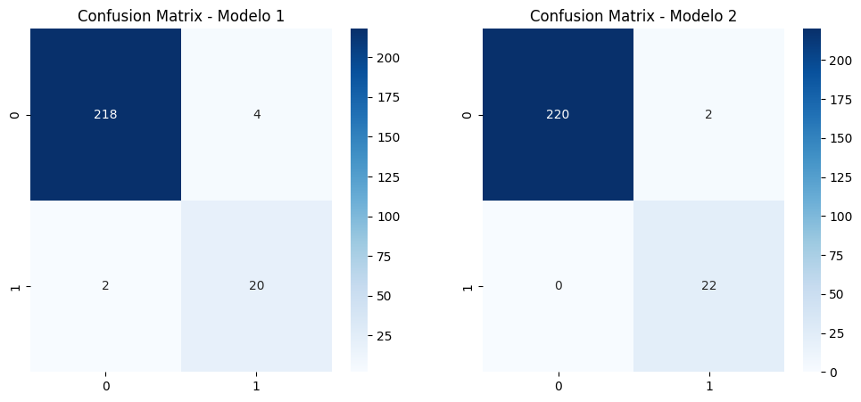
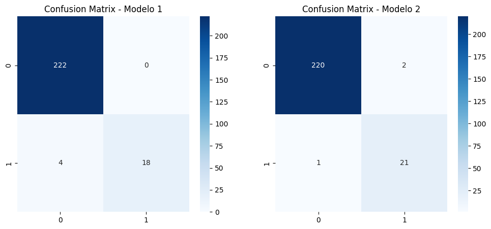
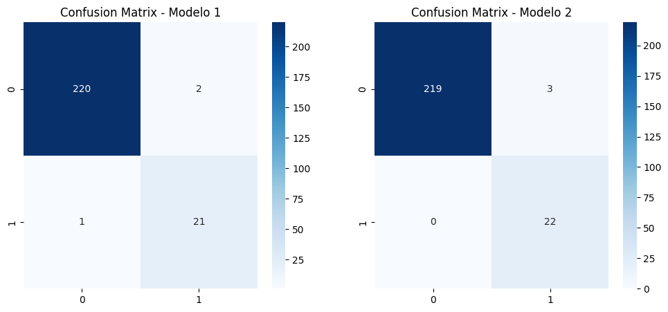

# DATA SCIENCE - Proyecto de Análisis de Expresión Génica en Cáncer mediante Aprendizaje Automático Supervisado
# Machine Learning Operations (MLOps)

¡Bienvenido al proyecto de análisis de expresión génica en cáncer! En este proyecto, utilizaremos técnicas de aprendizaje automático supervisado para clasificar tipos de cáncer y predecir resultados a partir de datos de expresión génica.

## DEFINICIÓN DEL PROBLEMA:

APRENDIZAJE SUPERVISADO PARA EL ANÁLISIS DE EXPRESIÓN GENÉTICA DEL CÁNCER El diagnóstico y pronóstico del cáncer a menudo dependen de la comprensión de los factores genéticos subyacentes y sus patrones de expresión. El aprendizaje automático supervisado (AMS) ofrece un conjunto de herramientas poderosas para construir modelos predictivos que pueden clasificar tipos de cáncer y predecir resultados clínicos basados en datos de expresión génica.

a. Declaración del Problema El desafío central de este proyecto es desarrollar y aplicar modelos de aprendizaje automático supervisado a un conjunto de datos de expresión génica del cáncer, con el objetivo de clasificar con precisión diferentes tipos de cáncer y predecir resultados clínicos. Esta tarea implica entrenar modelos en un conjunto de datos etiquetado donde los niveles de expresión de los genes se utilizan como características y el tipo o etapa del cáncer como la variable objetivo.

## Desafío Central:

El objetivo principal es desarrollar modelos de aprendizaje automático supervisado para analizar un conjunto de datos de expresión génica del cáncer. La meta es clasificar con precisión tipos de cáncer y predecir resultados clínicos.

## Datasets:

Se realizo el procesamiento de los datos de cuatro dataset:

BBRCA_Normal que se compone de 113 muestras y 23694 genes de Tejido Sólido Normal.
BRCA_PT que se compone de 1106 muestras y 23694 genes de Tumor primario.
la RED_PPI (se refiere a una red de interacciones de proteínas) contiene la interaccion de genes que están fuertemente conectados o interactúan significativamente entre sí a nivel proteico,  distribuidos en 34814 filas y 7 columnas.
GeneScore contine genes clasificados por el gen "PIK3R1" como obejtivo, distribuidos en 732 filas y 2 dos columnas.

Se realizó el procesamiento de cuatro conjuntos datos:

BBRCA_Normal: Compuesto de 113 muestras y 23,694 genes de tejido sólido normal.

BBRCA_Normal:: Compuesto por 1,106 muestras y 23,694 genes de tumor primario.

RED_PPI: Se refiere a una red de interacciones de proteínas que contiene las interacciones entre genes que están fuertemente conectados o interactúan significativamente entre sí a nivel proteico. Esta red está distribuida en 34,814 filas y 7 columnas.

GeneScore: Contiene genes clasificados por el gen "PIK3R1" como objetivo, distribuidos en 732 filas y 2 columnas.

Estos conjuntos de datos son fundamentales para el análisis de expresión génica en cáncer y la construcción de modelos de aprendizaje automático supervisado. La RED_PPI proporciona información valiosa sobre las interacciones proteicas, mientras que GeneScore ofrece genes clasificados en relación con PIK3R1.

## Data Analytics

### EDA:

Se llevó a cabo la combinación de datos en un solo conjunto denominado "normal_PT", que resulta de la fusión entre "BBRCA_Normal" y "BRCA_PT". Durante este proceso, se eliminaron columnas que no representaban valores significativos para el análisis. Se verificaron valores nulos y se aplicó un filtro de datos de expresión génica, estableciendo un umbral del 0.0001 de la máxima expresión de las muestras.

Posteriormente, se procedió a filtrar los genes que se expresaban en al menos el 20% de las muestras, eliminando aquellos que no cumplían con estos parámetros. Este paso permitió centrarnos en los genes más relevantes para el análisis.

Se llevó a cabo un análisis diferencial de expresión (DEA) para identificar posibles diferencias significativas en la expresión génica de los genes enlistados entre las muestras de 'Solid Tissue Normal' y 'Primary Tumor'. Los resultados de este análisis fueron guardados en un archivo CSV llamado "filtro_normal_PT".

Para la "RED_PPI", se verificaron nulos y características de los datos. Se realizó un filtro de genes utilizando "filtro_normal_PT" para identificar los genes comunes con la "RED_PPI". Se seleccionaron los 100 genes con el mayor grado de conexión en la red, los cuales serán utilizados como predictores en el análisis.

Asimismo, se llevó a cabo un análisis similar para "geneScore". Se verificaron los genes comunes con "filtro_normal_PT" y se filtraron los 100 genes con el mayor puntaje para utilizarlos como predictores en un segundo modelo.

Estos procesos de preprocesamiento y filtrado son esenciales para garantizar que trabajemos con datos relevantes y significativos en nuestro análisis de expresión génica en el contexto del cáncer.

Se pueden visualizar el análisis realizado en el siguiente [archivo](https://github.com/Milalex19/Proyecto-Analisis-Expresion-Genica/blob/main/EDA.ipynb)

## Machine Learning:

Se llevaron a cabo la construcción de cuatro modelos de Aprendizaje Automático para el diagnóstico y pronóstico del cáncer. Los modelos utilizados fueron Regresión Logística, Bosques Aleatorios (Random Forest), KNN y SVM.

La variable objetivo fue "sample_type" (Tejido Sólido Normal, Tumor Primario) para diagnóstico y pronóstico del cáncer. Como variables predictoras, se emplearon los 100 genes con mayor grado de conexión en la red de interacciones de proteínas (RED_PPI). Además, se exploró otra opción de variable predictora utilizando los 100 genes con el puntaje más alto según el GeneScore con el gen (PIK3R1).

## Modelo Random Forest:

Se implementó un modelo de Aprendizaje Automático utilizando la técnica de Bosques Aleatorios (Random Forest). Este modelo se diseñó con un ajuste específico de pesos de clase para abordar posibles desequilibrios en la distribución de clases.

El modelo se entrenó con el conjunto de entrenamiento (X_train y y_train).

Predicciones y Evaluación:
Se obtuvieron los siguentes resultados para ambos conjuntos de variables predictoras.

predictores obtenidos de la 'RED_PPI':                          |   predictores obtenidos de 'geneScore' (PIK3R1):
                                                                |
                                                                |
                     precision    recall  f1-score   support    |                       precision    recall  f1-score   support
Primary Tumor:           0.98      1.00      0.99       222     |   Primary Tumor:         0.98      1.00      0.99       222
Solid Tissue Normal:     0.95      0.82      0.88        22     |   Solid Tissue Normal:   0.95      0.82      0.88        22
accuracy:                                    0.98       244     |   accuracy:                                  0.98       244
macro avg:               0.96      0.91      0.93       244     |   macro avg:             0.96      0.91      0.93       244
weighted avg:            0.98      0.98      0.98       244     |   weighted avg:          0.98      0.98      0.98       244

Se observa que el rendimiento para este modelo fue bueno y no experimentó variaciones en sus resultados al cambiar las variables predictoras. Esto sugiere que el cambio en los genes predictores no afecta la eficacia de este modelo, que mantiene un rendimiento alto.

Se pueden visualizar el análisis realizado en el siguiente [archivo](https://github.com/Milalex19/Proyecto-Analisis-Expresion-Genica/blob/main/modelo_randomforest.ipynb)

## Modelo k-NN:

Se implementó un modelo de k-NN (vecinos más cercanos) utilizando un pipeline que incorpora la estandarización de los datos (StandardScaler()) y un clasificador k-NN (KNeighborsClassifier) con los siguientes parámetros:

n_neighbors=5: número de vecinos más cercanos a considerar.
metric='manhattan': métrica de distancia utilizada.
El modelo se entrenó con los datos de entrenamiento mediante el método fit del pipeline.

Predicciones y Evaluación:

Se realizaron predicciones en el conjunto de prueba utilizando el método predict del pipeline. La evaluación del rendimiento del modelo se llevó a cabo mediante métricas como la precisión, y se generó un informe de clasificación.

Resultados del Modelo:

Se obtuvieron los siguentes resultados para ambos conjuntos de variables predictoras.

predictores obtenidos de la 'RED_PPI':                          |   predictores obtenidos de 'geneScore' (PIK3R1):
                                                                |
                                                                |
                     precision    recall  f1-score   support    |                       precision    recall  f1-score   support
Primary Tumor:           0.99      0.98      0.99       222     |   Primary Tumor:         1.00      0.99      1.00       222
Solid Tissue Normal:     0.83      0.91      0.87        22     |   Solid Tissue Normal:   0.92      1.00      0.96        22
accuracy:                                    0.98       244     |   accuracy:                                  0.99       244
macro avg:               0.91      0.95      0.93       244     |   macro avg:             0.96      1.00      0.98       244
weighted avg:            0.98      0.98      0.98       244     |   weighted avg:          0.99      0.99      0.99       244

En general, ambos modelos presentan un rendimiento muy bueno, pero el segundo modelo destaca ligeramente al demostrar un mayor accuracy y recall para la clase "Solid Tissue Normal". Este segundo modelo parece ser más equilibrado y preciso, evidenciando valores más altos en todas las métricas.

Se pueden visualizar el análisis realizado en el siguiente [archivo](https://github.com/Milalex19/Proyecto-Analisis-Expresion-Genica/blob/main/modelo_KNN.ipynb)

## Modelo de Regresión Logística:

Se implementó un modelo de regresión logística con el parámetro de regularización C=0.1 y una semilla aleatoria para reproducibilidad (random_state=42). Además, se aplicó la estandarización de características utilizando StandardScaler().

El modelo se entrenó con las características estandarizadas del conjunto de entrenamiento.

Predicciones y Evaluación:

Se obtuvieron los siguentes resultados para ambos conjuntos de variables predictoras.

predictores obtenidos de la 'RED_PPI':                          |   predictores obtenidos de 'geneScore' (PIK3R1):
                                                                |
                                                                |
                     precision    recall  f1-score   support    |                       precision    recall  f1-score   support
Primary Tumor:           0.98      1.00      0.99       222     |   Primary Tumor:         1.00      0.99      0.99       222
Solid Tissue Normal:     1.00      0.82      0.90        22     |   Solid Tissue Normal:   0.91      0.95      0.93        22
accuracy:                                    0.98       244     |   accuracy:                                  0.99       244
macro avg:               0.99      0.91      0.95       244     |   macro avg:             0.95      0.97      0.96       244
weighted avg:            0.98      0.98      0.98       244     |   weighted avg:          0.99      0.99      0.99       244

En general, ambos modelos exhiben un rendimiento excepcional, con precisiones y recalls elevados. El segundo modelo presenta una ligera mejora en la precisión global (accuracy) y un mejor recall para la clase "Solid Tissue Normal".

Este modelo, implementado con regresión logística y estandarización de características, proporciona una herramienta valiosa para la clasificación de tipos de cáncer basada en la expresión génica de los genes seleccionados.

Se pueden visualizar el análisis realizado en el siguiente [archivo](https://github.com/Milalex19/Proyecto-Analisis-Expresion-Genica/blob/main/modelo_regresion.ipynb)

## Modelo de Máquinas de Soporte Vectorial (SVM):

Se implementó un modelo de Máquinas de Soporte Vectorial (SVM) mediante un pipeline que incorpora la estandarización de los datos (StandardScaler()) y un kernel polinómico (SVC(kernel='poly', degree=3, gamma='scale', coef0=1, C=1.0, random_state=42)).

El modelo SVM se entrenó con los datos de entrenamiento utilizando el método fit del pipeline.

Predicciones y Evaluación:

Se obtuvieron los siguentes resultados para ambos conjuntos de variables predictoras.

predictores obtenidos de la 'RED_PPI':                          |   predictores obtenidos de 'geneScore' (PIK3R1):
                                                                |
                                                                |
                     precision    recall  f1-score   support    |                       precision    recall  f1-score   support
Primary Tumor:           1.00      0.99      0.99       222     |   Primary Tumor:         1.00      0.99      0.99       222
Solid Tissue Normal:     0.91      0.95      0.93        22     |   Solid Tissue Normal:   0.88      1.00      0.94        22
accuracy:                                    0.99       244     |   accuracy:                                  0.99       244
macro avg:               0.95      0.97      0.96       244     |   macro avg:             0.94      0.99      0.96       244
weighted avg:            0.99      0.99      0.99       244     |   weighted avg:          0.99      0.99      0.99       244

En general, ambos modelos SVM exhiben un rendimiento muy similar, con una alta precisión global y un buen equilibrio entre precisión y recall. Ambos modelos han alcanzado una accuracy del 98.77%, indicando su capacidad para clasificar correctamente la gran mayoría de las muestras.

Este modelo, implementado con SVM y kernel polinómico junto con la estandarización de características, proporciona una herramienta valiosa para la clasificación de tipos de cáncer basada en la expresión génica de los genes seleccionados.

Se pueden visualizar el análisis realizado en el siguiente [archivo](https://github.com/Milalex19/Proyecto-Analisis-Expresion-Genica/blob/main/modelo_svm.ipynb)

## Conclusión:

Para los modelos en los que se utilizaron como predictores los genes obtenidos de la 'RED_PPI', se observa un rendimiento general sólido con altos valores de precisión, recall y F1-score. En cuanto a la exactitud (accuracy), los modelos Random Forest, Regresión Logística y SVM muestran un desempeño similar, mientras que KNN presenta una puntuación ligeramente inferior.

En el caso de los modelos en los que se utilizaron como predictores los genes obtenidos de 'geneScore', específicamente con (PIK3R1), se evidencia un rendimiento muy bueno con altos valores de precisión, recall y F1-score. KNN destaca con la mayor exactitud, alcanzando el 99.18%, y muestra un desempeño excelente en todas las métricas evaluadas.

En términos generales, los modelos con predictores de 'geneScore' presentan un mejor rendimiento; sin embargo, los demás modelos también exhiben un desempeño sólido.

## Tecnologia utilizada:

